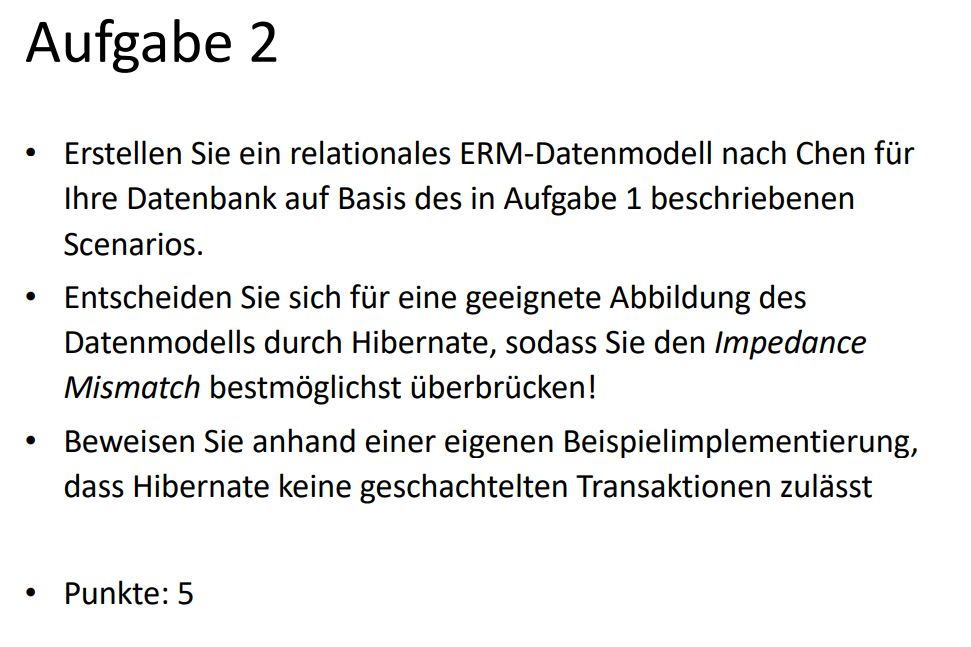
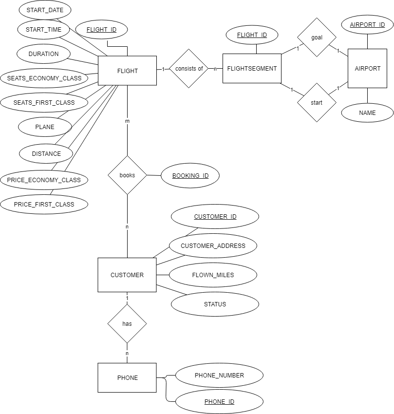
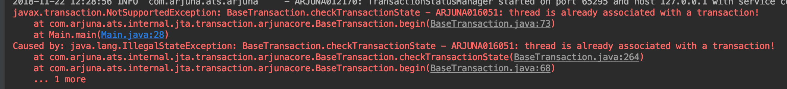

# ERM-Datenmodell


# Datenmodell
Alle Strukuten, die sonst als Arrays implementiert werden konnten, werden zu Beziehungen zwischen Klassen. 


# Geschachtelte Transaktionen
```
tm.begin();
tm.begin();
```
führt zu:



