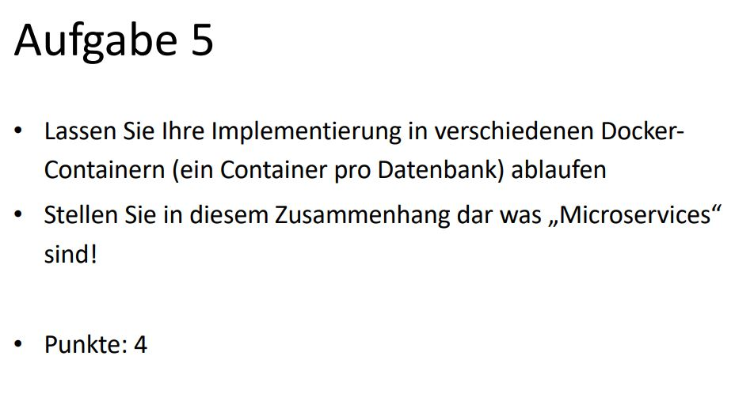

# Docker-Container
Gelößt durch ein Docker-Compose File, das alle Container verwaltet.

# Microservices
Aufteilung der Software in einzelne Prozesse.

Bei uns: 
- Datenbanken
- REST-Server
- Static-File-Server für das Frontend
